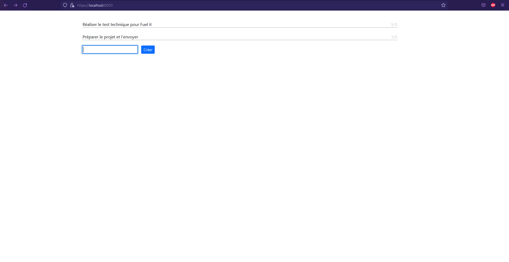
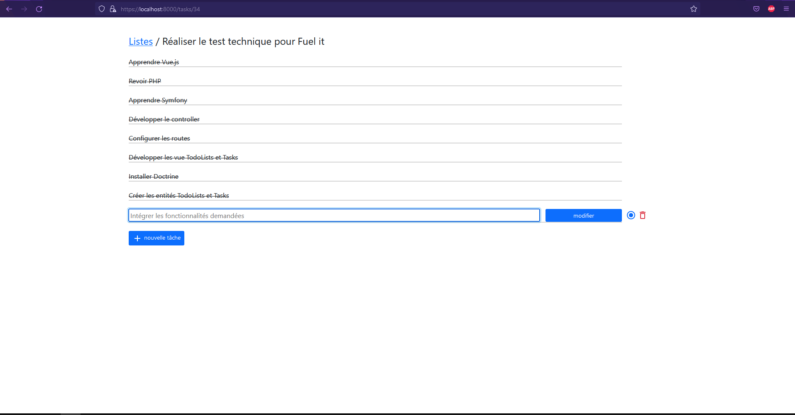

# Todo App

Développement d'une todo-list avec Symfony, Vue.js, sqlite et Bootstrap.  

*"Bootstrap a été utilisé dans le but de simplifier la mise en place du design et permettre de se focaliser sur la partie back-end de l'application."*

## Installation

#### Installation des dépendance et ajout de la BdD :
- Ajouter la ligne : `DATABASE_URL="sqlite:///%kernel.project_dir%/var/data.db"` dans le fichier .env à la racine du projet.
- Modifier la ligne : `APP_ENV=dev`  en `APP_ENV=prod` dans le fichier .env à la racine du projet.
- Lancer la commande : `composer install` pour installer les dépendances.

#### Mise à jour de la BdD :
- `php bin/console doctrine:schema:update --dump-sql`
- `php bin/console doctrine:schema:update --force`

#### Installation de Encore :
- `npm install @symfony/webpack-encore --dev`  

**ou**
- `yarn add @symfony/webpack-encore --dev`

## Lancement du serveur

- `symfony server`
- `yarn encore dev-server --hot`
- Url : `localhost:8000`